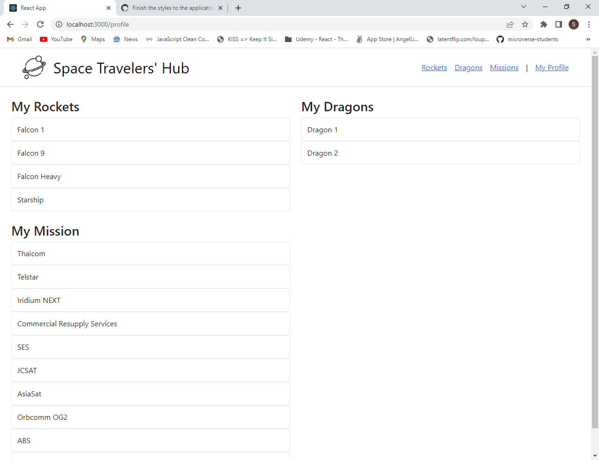

# Space Travelers' Hub

> A React web app that renders a list of bookable rockets and missions.




**This is a web App built with React that allows users to:**
- Visualize a list of SpaceX's rockets, dragons, and missions from public API.
- Book a rocket, dragon, or mission.
- Cancel a reserved item.
- Visualize reserved items on the My Profile page.

**Features:**
- Single Page App developed with React Router
- Used Redux as a state management tool.
- Used SpaceX's public APIs.


## Built With

- HTML
- CSS
- JavaScript
- React
- Redux
- APIs

## Live Page

[Click Here](https://bookhttps://github.com/Saadat123456/Space-Travelers-Hub/)


## Getting Started

To get a local copy up and running follow these simple steps.

### Prerequisites

- Have git correctly installed.
- Have NPM and NodeJs correctly installed.

### Setup

- Open a terminal window where you want to have installed a copy of the repository.

### Install

- Use this command to clone the repo:
```
$ git clone git@github.com:Saadat123456/Space-Travelers-Hub.git
```
- Install the required dependencies:
```
$ npm install
```
### Usage

- Run:
```
$ npm start
```
- Build:
```
$ npm run build
```
- Testing:
```
$ npm test
```
- Edit the content as you like.


## Authors

👤 **Kenny Salazar**

- GitHub: [@helio3197](https://github.com/helio3197)
- Twitter: [@kennysalazar31](https://twitter.com/kennysalazar31)
- LinkedIn: [LinkedIn](https://linkedin.com/in/kenny-salazar-1a1687110)

👤 **Saadat Ali**

- GitHub: [@Saadat123456](https://github.com/Saadat123456)
- Twitter: [@Saadat02021999](https://twitter.com/Saadat02021999)
- LinkedIn: [LinkedIn](https://www.linkedin.com/in/saadatali1999/)

👤 **Ntare Guy**

- GitHub: [@41hulk](https://github.com/41hulk)
- Twitter: [@ntare_guy](https://twitter.com/ntare_guy)
- LinkedIn: [LinkedIn](https://www.linkedin.com/in/ntare-guy/)


## 🤝 Contributing

Contributions, issues, and feature requests are welcome!

Feel free to check the [issues page](../../issues/).

## Show your support

Give a ⭐️ if you like this project!

## Acknowledgments

- Thanks to Microverse for the guidelines.


## 📝 License

This project is [MIT](./MIT.md) licensed.
